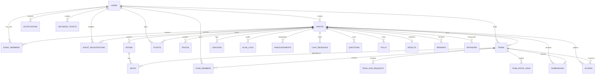

# 🗄️ Database Schema Reference — Event OS

Event OS utilizes Supabase PostgreSQL with UUID primary keys, foreign key cascade constraints, unique constraints, and B-tree indexes for high-throughput queries.

---

## 📊 Entity Relationship (ER) Diagram

---

## 📋 Comprehensive Tables Inventory

### 1. `users` (Auth Service)
| Column | Type | Constraints | Description |
| :--- | :--- | :--- | :--- |
| `id` | `UUID` | `PRIMARY KEY DEFAULT gen_random_uuid()` | Unique user identifier |
| `name` | `VARCHAR(255)` | `NOT NULL` | Full display name |
| `email` | `VARCHAR(255)` | `NOT NULL UNIQUE` | Unique email address |
| `password_hash` | `VARCHAR(255)` | `NOT NULL` | Bcrypt hashed password |
| `role` | `VARCHAR(50)` | `CHECK IN ('USER', 'PARTICIPANT', 'TEAM_LEAD', 'ADMIN', 'SUPER_ADMIN')` | Global system role |
| `phone` | `VARCHAR(50)` | `NULLABLE` | Contact phone number |
| `profile_image`| `TEXT` | `NULLABLE` | Avatar URL |
| `created_at` | `TIMESTAMPTZ` | `DEFAULT NOW()` | Record creation timestamp |
| `updated_at` | `TIMESTAMPTZ` | `DEFAULT NOW()` | Modification timestamp |

### 2. `events` (Event Service)
| Column | Type | Constraints | Description |
| :--- | :--- | :--- | :--- |
| `id` | `UUID` | `PRIMARY KEY DEFAULT gen_random_uuid()` | Event unique identifier |
| `name` | `VARCHAR(255)` | `NOT NULL` | Event title |
| `description` | `TEXT` | `NULLABLE` | Detailed description |
| `venue` | `VARCHAR(255)` | `NOT NULL` | Venue location / link |
| `start_date` | `TIMESTAMPTZ` | `NOT NULL` | Event start timestamp |
| `end_date` | `TIMESTAMPTZ` | `NOT NULL` | Event end timestamp |
| `capacity` | `INTEGER` | `NOT NULL CHECK (capacity >= 0)` | Maximum attendee capacity |
| `status` | `VARCHAR(50)` | `CHECK IN ('DRAFT', 'PUBLISHED', 'UPCOMING', 'ONGOING', 'COMPLETED', 'CANCELLED')` | Event lifecycle state |
| `join_code` | `VARCHAR(50)` | `UNIQUE` | Short join code for participants |
| `retention_days`| `INTEGER` | `DEFAULT 30` | Days to retain PII after close |
| `is_closed` | `BOOLEAN` | `DEFAULT FALSE` | Closed registration flag |
| `closed_at` | `TIMESTAMPTZ` | `NULLABLE` | Timestamp when event closed |
| `created_by` | `UUID` | `REFERENCES users(id) ON DELETE CASCADE` | Creator user ID |

### 3. `event_registrations` (Event Service)
| Column | Type | Constraints | Description |
| :--- | :--- | :--- | :--- |
| `id` | `UUID` | `PRIMARY KEY DEFAULT gen_random_uuid()` | Registration ID |
| `event_id` | `UUID` | `REFERENCES events(id) ON DELETE CASCADE` | Associated event |
| `user_id` | `UUID` | `REFERENCES users(id) ON DELETE CASCADE` | Registered participant |
| `status` | `VARCHAR(50)` | `DEFAULT 'REGISTERED'` | Registration status |
| `college` | `VARCHAR(255)` | `NULLABLE` | Participant university / college |
| `skills` | `TEXT[]` | `NULLABLE` | Array of skill tags |
| `social_links` | `JSONB` | `DEFAULT '{}'::jsonb` | GitHub/LinkedIn URLs |
| `consent_at` | `TIMESTAMPTZ` | `NULLABLE` | Terms consent timestamp |
| `looking_for_team`| `BOOLEAN`| `DEFAULT FALSE` | LFT pool discovery toggle |
| `qr_payload` | `TEXT` | `NULLABLE` | Pre-generated QR payload |
| `registered_at`| `TIMESTAMPTZ`| `DEFAULT NOW()` | Registration timestamp |

### 4. `teams` (Team Service)
| Column | Type | Constraints | Description |
| :--- | :--- | :--- | :--- |
| `id` | `UUID` | `PRIMARY KEY DEFAULT gen_random_uuid()` | Team ID |
| `name` | `VARCHAR(255)` | `NOT NULL` | Team name |
| `description` | `TEXT` | `NULLABLE` | Project premise |
| `event_id` | `UUID` | `REFERENCES events(id) ON DELETE CASCADE` | Associated event |
| `team_code` | `VARCHAR(50)` | `UNIQUE` | Short team join code |
| `status` | `VARCHAR(50)` | `DEFAULT 'ACTIVE'` | Team status |
| `track_id` | `UUID` | `REFERENCES tracks(id) ON DELETE SET NULL` | Assigned track |
| `room_id` | `UUID` | `REFERENCES rooms(id) ON DELETE SET NULL` | Assigned room |
| `seat_label` | `VARCHAR(100)` | `NULLABLE` | Assigned table / seat |
| `created_by` | `UUID` | `REFERENCES users(id) ON DELETE CASCADE` | Team lead user ID |

### 5. `team_members` (Team Service)
| Column | Type | Constraints | Description |
| :--- | :--- | :--- | :--- |
| `id` | `UUID` | `PRIMARY KEY DEFAULT gen_random_uuid()` | Membership ID |
| `team_id` | `UUID` | `REFERENCES teams(id) ON DELETE CASCADE` | Team |
| `user_id` | `UUID` | `REFERENCES users(id) ON DELETE CASCADE` | Participant |
| `role` | `VARCHAR(50)` | `CHECK IN ('TEAM_LEAD', 'MEMBER', 'VOLUNTEER')` | Member role |
| `joined_at` | `TIMESTAMPTZ` | `DEFAULT NOW()` | Join timestamp |

### 6. `tickets` (Ticket Service)
| Column | Type | Constraints | Description |
| :--- | :--- | :--- | :--- |
| `id` | `UUID` | `PRIMARY KEY DEFAULT gen_random_uuid()` | Ticket ID |
| `event_id` | `UUID` | `REFERENCES events(id) ON DELETE CASCADE` | Event |
| `user_id` | `UUID` | `REFERENCES users(id) ON DELETE CASCADE` | Attendee |
| `ticket_code` | `VARCHAR(100)` | `NOT NULL UNIQUE` | Unique code (TKT-...) |
| `status` | `VARCHAR(50)` | `CHECK IN ('ACTIVE', 'USED', 'CANCELLED', 'EXPIRED')` | Status |
| `price` | `NUMERIC(10,2)`| `DEFAULT 0.00` | Ticket price |
| `qr_data` | `TEXT` | `NULLABLE` | HMAC signed QR payload |

### 7. `scan_logs` (Checkin Service)
| Column | Type | Constraints | Description |
| :--- | :--- | :--- | :--- |
| `id` | `UUID` | `PRIMARY KEY DEFAULT gen_random_uuid()` | Scan log ID |
| `event_id` | `UUID` | `REFERENCES events(id) ON DELETE CASCADE` | Event |
| `participant_id`| `UUID` | `REFERENCES users(id) ON DELETE CASCADE` | Participant |
| `type` | `VARCHAR(50)` | `CHECK IN ('CHECKIN', 'LUNCH', 'DINNER', 'SWAG')` | Checkpoint type |
| `scanned_by` | `UUID` | `REFERENCES users(id) ON DELETE SET NULL` | Staff member |
| `scanned_at` | `TIMESTAMPTZ` | `DEFAULT NOW()` | Scan timestamp |
| `idempotency_key`| `VARCHAR(255)`| `UNIQUE` | Client deduplication key |

### 8. `submissions` (Event Service)
| Column | Type | Constraints | Description |
| :--- | :--- | :--- | :--- |
| `id` | `UUID` | `PRIMARY KEY DEFAULT gen_random_uuid()` | Submission ID |
| `event_id` | `UUID` | `REFERENCES events(id) ON DELETE CASCADE` | Event |
| `team_id` | `UUID` | `REFERENCES teams(id) ON DELETE CASCADE` | Submitting team |
| `repo_url` | `TEXT` | `NOT NULL` | GitHub / Git repository URL |
| `demo_url` | `TEXT` | `NULLABLE` | Live demo URL |
| `description` | `TEXT` | `NULLABLE` | Project overview |
| `file_url` | `TEXT` | `NULLABLE` | Uploaded deck/diagram URL |
| `is_locked` | `BOOLEAN` | `DEFAULT FALSE` | Edit lock flag |
| `submitted_at` | `TIMESTAMPTZ` | `DEFAULT NOW()` | Timestamp |

### 9. `scores` (Event Service)
| Column | Type | Constraints | Description |
| :--- | :--- | :--- | :--- |
| `id` | `UUID` | `PRIMARY KEY DEFAULT gen_random_uuid()` | Scorecard ID |
| `event_id` | `UUID` | `REFERENCES events(id) ON DELETE CASCADE` | Event |
| `team_id` | `UUID` | `REFERENCES teams(id) ON DELETE CASCADE` | Evaluated team |
| `judge_id` | `UUID` | `REFERENCES users(id) ON DELETE CASCADE` | Assigned judge |
| `criteria` | `JSONB` | `DEFAULT '{}'::jsonb` | Criteria breakdown |
| `total` | `NUMERIC(6,2)` | `DEFAULT 0.00` | Normalized score sum |
| `feedback` | `TEXT` | `NULLABLE` | Judge feedback comments |

### 10. `results` (Event Service)
| Column | Type | Constraints | Description |
| :--- | :--- | :--- | :--- |
| `id` | `UUID` | `PRIMARY KEY DEFAULT gen_random_uuid()` | Results record ID |
| `event_id` | `UUID` | `REFERENCES events(id) ON DELETE CASCADE UNIQUE` | Event |
| `status` | `VARCHAR(50)` | `CHECK IN ('DRAFT', 'REVIEW', 'PUBLISHED')` | Publishing stage |
| `payload` | `JSONB` | `DEFAULT '{}'::jsonb` | Structured rankings & winners |
| `published_at` | `TIMESTAMPTZ` | `NULLABLE` | Public release timestamp |
| `created_by` | `UUID` | `REFERENCES users(id) ON DELETE CASCADE` | Lead organizer |
