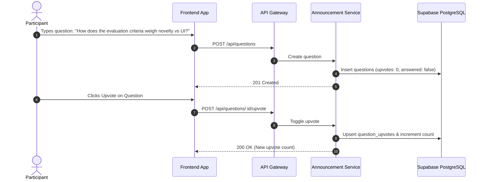

# 💬 Workflow: Community Chat & Live Q&A

Event OS features channel-based community chat with moderation muting, live stage Q&A questions with upvoting, and interactive polls.

---

## 🏛️ 1. Channel-Based Community Chat

- **Channels Supported:** `general`, `announcements`, `help`, `random`, or custom track channels (`ai-track`, `web3-track`).
- **Rate Limiting:** Participants are limited to 5 messages per 10 seconds to prevent spam abuse (`chatRateLimiter`).
- **Moderation Muting:** Organizers can mute disruptive participants for a configurable duration.

### Post Message
- **Endpoint:** `POST /api/chat/messages`
- **Body:** `{ "channel": "general", "body": "Where is the mentor desk located?" }`

### Mute User
- **Endpoint:** `POST /api/chat/mute`
- **Headers:** `Authorization: Bearer <Admin_JWT>`
- **Body:** `{ "userId": "disruptive-user-uuid", "durationMinutes": 60, "reason": "Spamming chat" }`

---

## 🙋 2. Stage Q&A & Upvoting

Enables attendees in an auditorium or livestream to submit questions. Other attendees upvote good questions, surfacing top questions for speakers and organizers.



---

## 📊 3. Interactive Polls

Organizers create live multiple-choice polls; attendees vote and view real-time vote distribution.

### Create Poll
- **Endpoint:** `POST /api/polls`
- **Body:**
  ```json
  {
    "question": "Which workshop topic do you want to attend next?",
    "options": ["LangChain Agents", "Zero Knowledge Proofs", "Mobile Flutter"]
  }
  ```

### Vote on Poll
- **Endpoint:** `POST /api/polls/:id/vote`
- **Body:** `{ "optionId": "opt-1-uuid" }`
