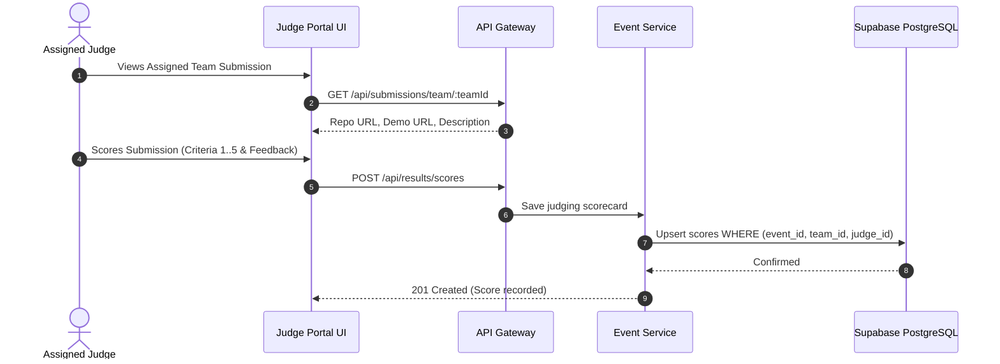

# ⚖️ Workflow: Judging & Scoring System

The Judging module enables assigned judges and organizers to evaluate team submissions against multiple rubric criteria (e.g. Innovation, Technical Depth, UI/UX, Presentation).

---

## 🏗️ Scorecard Rubric Structure

Each judge submits a JSON scorecard:

```json
{
  "teamId": "team-uuid",
  "criteria": {
    "innovation": 25,
    "technicalComplexity": 30,
    "uiUx": 20,
    "businessImpact": 15,
    "presentation": 10
  },
  "feedback": "Outstanding implementation of quantum circuits with a polished Next.js dashboard."
}
```

The backend automatically sums the criteria scores into a normalized `total` field (max 100.00).

---

## 🔄 Judging Sequence



---

## 🛠️ API Reference

### 1. Submit Scorecard
- **Endpoint:** `POST /api/results/scores`
- **Headers:** `Authorization: Bearer <Judge_JWT>`
- **Body:**
  ```json
  {
    "teamId": "team-uuid",
    "criteria": { "technical": 40, "novelty": 30, "pitch": 30 },
    "feedback": "Great live demonstration."
  }
  ```

### 2. List Judging Scores (Admins & Judges)
- **Endpoint:** `GET /api/results/scores?eventId=evt-uuid`
