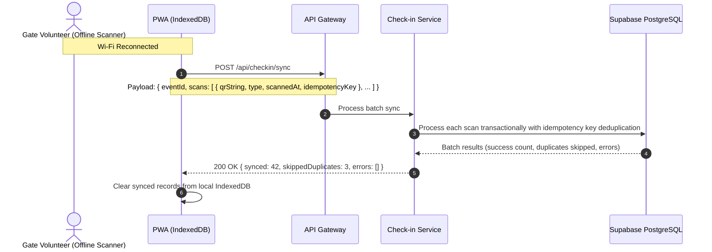

# 📶 Workflow: Offline Check-in, Roster Caching & Batch Sync

In real-world venues (convention centers, basements, campus grounds), Wi-Fi and cellular connectivity can drop. Event OS includes a resilient 3-layer offline check-in architecture.

---

## 🏗️ The 3-Layer Resilience Architecture

```text
Layer 1: Online Real-Time Scanning
  └─ Direct REST calls to POST /api/checkin/scan.

Layer 2: Offline Scanner PWA (Cached Roster & IndexedDB Queue)
  ├─ 1. Download Roster Cache: GET /api/checkin/roster/:eventId
  ├─ 2. Scan & Validate locally against cached HMAC public key / participant list.
  ├─ 3. Append to IndexedDB scan queue with UUID idempotency keys.
  └─ 4. When Wi-Fi reconnects: POST /api/checkin/sync with batch array.

Layer 3: Printed Roster Fallback Reconciliation
  └─ Upload paper check-in participant IDs: POST /api/checkin/reconcile-printed
```

---

## 🔄 Batch Sync Protocol



---

## 🛠️ API Reference

### 1. Download Offline Roster Cache
- **Endpoint:** `GET /api/checkin/roster/:eventId`
- **Response:**
  ```json
  {
    "success": true,
    "data": {
      "eventId": "evt-101",
      "participants": [
        { "id": "usr-1", "name": "Alice", "ticketCode": "TKT-001" },
        { "id": "usr-2", "name": "Bob", "ticketCode": "TKT-002" }
      ],
      "generatedAt": "2026-10-06T08:00:00.000Z"
    }
  }
  ```

### 2. Batch Sync Scans
- **Endpoint:** `POST /api/checkin/sync`
- **Headers:** `Authorization: Bearer <JWT>`
- **Body:**
  ```json
  {
    "eventId": "evt-101",
    "scans": [
      {
        "qrString": "usr-1|evt-101|1743948000|v1|3f8a...",
        "type": "CHECKIN",
        "scannedAt": "2026-10-06T09:15:00.000Z",
        "idempotencyKey": "batch_scan_01_a9f2"
      }
    ]
  }
  ```

### 3. Printed Paper Roster Reconciliation
- **Endpoint:** `POST /api/checkin/reconcile-printed`
- **Body:**
  ```json
  {
    "eventId": "evt-101",
    "participantIds": ["usr-1", "usr-2", "usr-3"],
    "type": "CHECKIN"
  }
  ```
