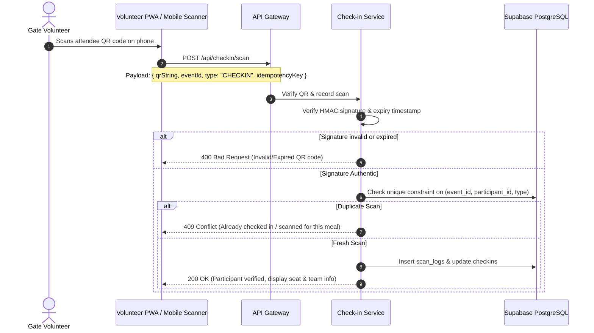

# 📱 Workflow: QR Check-in & Multi-Scan Verification

Event OS uses cryptographically signed, tamper-resistant QR codes that support gate entry (`CHECKIN`), meal checkpoints (`LUNCH`, `DINNER`), and swag distribution (`SWAG`).

---

## 🔒 QR Code Cryptographic Structure

The QR payload is an HMAC-SHA256 signed pipe-delimited string:

```text
<participantId>|<eventId>|<expiryTimestamp>|<version>|<hmacSha256Signature>
```

- **Example Payload:**
  `usr_9281|evt_3019|1743948000|v1|a4f91e92bc4728d...`
- **Signing Secret:** Stored exclusively in backend environment (`QR_SIGNING_SECRET` / `JWT_SECRET`). Never transmitted to client apps.
- **Tamper Resistance:** Modifying `participantId`, `eventId`, or `expiry` invalidates the HMAC signature.

---

## 🔄 Scan Execution Flow



---

## 🛠️ API Payload & Response

### Scan Request
- **Endpoint:** `POST /api/checkin/scan`
- **Headers:** `Authorization: Bearer <Staff/Volunteer_JWT>`
- **Body:**
  ```json
  {
    "qrString": "usr-123|evt-456|1743948000|v1|3a8f...",
    "eventId": "evt-456",
    "type": "CHECKIN",
    "idempotencyKey": "scan_client_uuid_104"
  }
  ```

### Success Response
```json
{
  "success": true,
  "message": "Scan recorded successfully",
  "data": {
    "scanType": "CHECKIN",
    "participant": {
      "id": "usr-123",
      "name": "Alice Wonderland",
      "email": "alice@example.com"
    },
    "team": {
      "name": "Quantum Coders",
      "seatInfo": {
        "roomName": "Main Auditorium",
        "seatLabel": "Table 14-A"
      }
    },
    "scannedAt": "2026-10-06T14:30:00.000Z"
  }
}
```
