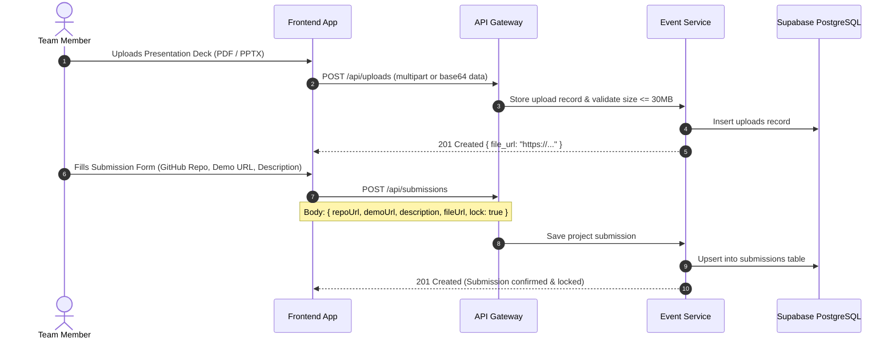

# 🚀 Workflow: Project Submissions & File Uploads

Event OS provides a secure project submission workflow allowing teams to submit Git repositories, live demos, and upload project assets (presentation decks, architecture diagrams, demo videos) up to 30MB.

---

## 🔒 Submission Locking & Rules
- **One Submission Per Team:** Unique constraint on `(event_id, team_id)`.
- **URL Validation:** Repository URLs must be valid HTTP/HTTPS URLs (e.g. GitHub, GitLab).
- **Locking:** Teams can set `lock: true` to prevent accidental edits once final judging begins.

---

## 🔄 Sequence Diagram



---

## 🛠️ API Reference

### 1. Submit Project
- **Endpoint:** `POST /api/submissions`
- **Headers:** `Authorization: Bearer <JWT>`
- **Body:**
  ```json
  {
    "repoUrl": "https://github.com/quantum-coders/qml-pipeline",
    "demoUrl": "https://qml-demo.vercel.app",
    "description": "Quantum machine learning pipeline for drug discovery",
    "fileUrl": "https://storage.eventos.internal/uploads/deck.pdf",
    "lock": true
  }
  ```

### 2. View Team Submission
- **Endpoint:** `GET /api/submissions/team/:teamId`

### 3. Upload File
- **Endpoint:** `POST /api/uploads`
- **Body:**
  ```json
  {
    "fileName": "pitch-deck.pdf",
    "mimeType": "application/pdf",
    "fileSize": 4194304,
    "category": "PRESENTATION",
    "fileData": "base64-or-multipart-payload..."
  }
  ```
