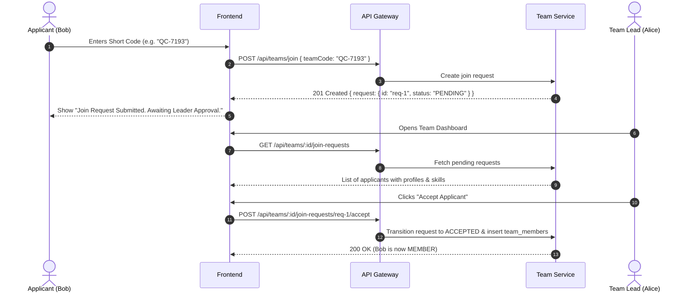

# 🔗 Workflow: Team Invitation & Approval Flow

Event OS supports two invitation methods: **Short Join Codes** and **Tokenized Shareable Invite Links**. Both flows require Team Lead approval before the applicant becomes an active member.

---

## 🎟️ Flow A: Join via Team Short Code



---

## 🌐 Flow B: Join via Tokenized Invite Link

### 1. Lead Generates Link
- **Endpoint:** `POST /api/teams/:id/invite-link`
- **Body:**
  ```json
  {
    "expiresInHours": 48,
    "maxUses": 4
  }
  ```
- **Response:**
  ```json
  {
    "success": true,
    "data": {
      "token": "inv_9f82ab7c10...",
      "expires_at": "2026-10-08T12:00:00.000Z",
      "invite_url": "http://localhost:3000/teams/invite/inv_9f82ab7c10..."
    }
  }
  ```

### 2. Applicant Opens Link
- **Endpoint:** `GET /api/teams/invite/:token`
- **Response:** Returns team metadata, event name, creator name, and active member count.

### 3. Applicant Submits Link Join Request
- **Endpoint:** `POST /api/teams/invite/:token/join`
- **Response:** Creates `team_join_requests` with status `PENDING`.
- **Team Lead Approval:** The Team Lead reviews and approves at `POST /api/teams/:id/join-requests/:requestId/accept`.
